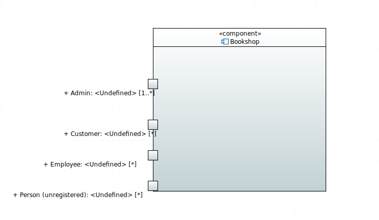
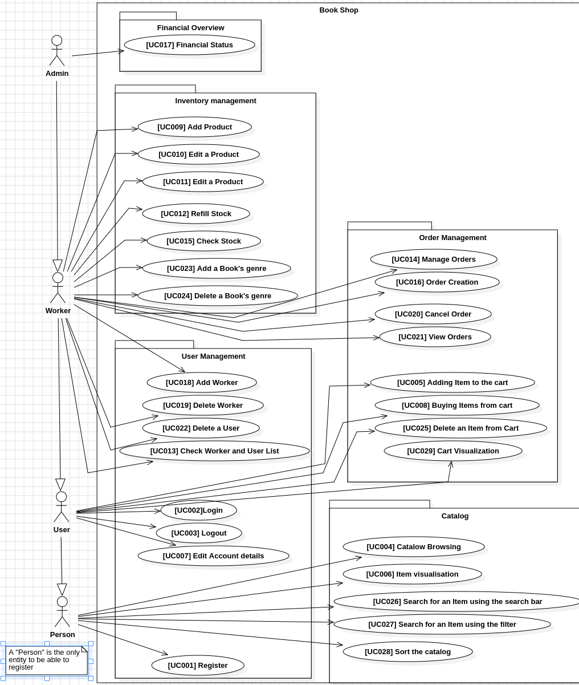

:project_name: Buchhandlung Schiller
:author: Willi Richter, Vincent Richter, Martin Najera, Linus Leuner, Marco Hernandez, Emilio Leuoth, Erion Leka, Kevin Grandl
:revnumber: 1.0
:revdate: {docdatetime}
:company_name: "Buchhandlung SCHILLER"
:revremark: Work in Progress
:doctype: book
:icons: font
:source-highlighter: highlightjs
:toc: left
:numbered:

= Pflichtenheft __{project_name}__

[options="header"]
[cols="1, 3, 3"]
|===
|Version | Processing Date   | Authors
|1.0	| October 31st, 2024 | {author}

|===

== Task Definition

The Bookstore {company_name} is seeking a web application to expand its business model,
allowing for efficient sales and management of books as well as potential non-book items.
The application will support user, item, and order management to streamline operations for
employees while enhancing the shopping experience for customers.

The application will support multiple roles: Customers, Employees, and Admins. Each user
can create an account, view and edit personal data, and delete their account if desired.
Customers will be able to browse the catalog without logging in but must log in to access
the shopping cart and place orders. In addition, employees and Admins can also be customers
and enjoy similar functionality. Employee permissions include managing the inventory, such
as adding, editing and removing books and other items, viewing customer and order
lists, confirming payments, and canceling orders. Admins, in addition to all employee
permissions, have full system access, including adding or removing employees. It is
required that there must always be at least one active Admin in the system.

The Item Management system will include books and other potential items like merchandise
or calendars. Each book entry must include fields for the author, publisher, ISBN, a brief
description, and a cover image, with books classified into at least one of the following
genres: Fiction, Non-Fiction, Entertainment, or Guide with the possibility to add or edit
genres later on. Employees and Admins should have the ability to edit and add both books
and genres, ensuring that each book belongs to at least one genre. Non-book items, such as
merchandise, will have fields for name, description, price, and stock, and all items will
receive unique identifiers, Stock management is essential: items should not decrease in
stock unless purchased, and any item that runs out of stock must display as such to customers.

The Order Management system will allow customers to order items with payment options of
either invoice or cash on pickup. The order date will automatically record on the day the
order is placed, and the expected delivery date is set to three days after this order date.
Employees will handle shipments manually once payment is confirmed, with system-generated
updates on order and delivery statuses as they progress. The inventory is only adjusted when
the payment process is initiated, ensuring stock is correctly accounted for.

A Financial Overview feature, available only to Admins, will provide a monthly revenue
summary without a breakdown by category. This overview will include a simple chart
displaying monthly revenue trends over time, with historical data accessible as well.
Revenue should be calculated upon order payment confirmation (immediate for cash orders)
and will appear in the financial overview as earnings for the respective order month.

The User Interface (UI) will feature a navigational bar with different options depending on
permissions set according to each user's role. The login screen will be universal across
roles. The application will support search and filter options, enabling users to search
by genre, author, and title and sort results by author, title, price, and release date.
Stock availability will also be displayed in real-time, providing visibility for any
items that are out of stock.

== Product Usage

The system will serve as a web shop for {company_name} to sell books, calendars,
and merchandise. The software will be hosted on a server and made accessible to customers
via the internet through standard web browsers.

The platform will be compatible with and visually optimized for all major web browsers to
ensure a seamless user experience.

The main users will be customers, familiar with standard website navigation, along with
administrators and employees, who may not have technical expertise.

The system is designed to operate without the need for technical maintenance. All data
will be stored persistently in a database and accessible directly through the application.

[[Stakeholders]]
== Stakeholders
Here is every group or individual listed, which/who has an impact on the requirements of the system.

The assigned priorities range from 5 (highest priority) to 1 (lowest priority)

[options="header", cols="2, ^1, 4, 4"]
|===
|Name
|Priority (1..5)
|Description
|Goals

|{company_name}
|5
|The primary client of this project.
a|
- Sell more Products
- Automate processes
- Manage orders, inventory and employees
- get monthly overview of revenue

|Customer
|4
|Primary user of the application,
a|
- Great user experience
- Easily browsable catalog
- Fast and easy ordering process

|Admin
|3
|Users who administer the application
a|
- Possibility to overview all data in the system

|Employee
|2
|User who works for {company_name}
a|
- Manage Orders, Customers and Inventory
- efficient workflow

|Developers
|1
|People who are either implementing the application or are responsible for maintenance later on.
a|
- Low maintenance effort
- Easily expandable software

|===

== System Boundaries and Component Structure

=== System Context Diagram

[[context_diagram]]

=== Top-level architecture

[[TLA]]
image::./models/analysis/TopLevelArchitecturDiagramm/TopLevelArchitecturDiagramm.png[top-level architecture, 100%, 100%, pdfwidth=100%, title= "Top Level Architecture of the {project_name} in UML", align=center]

== Use-Cases

=== Actors

[options="header"]
[cols="1,4"]
[[registered_user]]
[[actors]]
|===
|Name |Description
|Person               | Representative for unauthenticated access (i.e. unauthenticated visitors)|Customer (extends Person)   | Representative for every person, who does have an account, is authenticated and interacts with the system. This Role can buy the content of the cart.
|Employee (extends Customer) | Any registered (and authenticated) user, who has the Role "Employee".
|Admin (extends Employee)          | Any registered (and authenticated) user, who has the Role "Admin". Is responsible for administration of the application. At least one Admin must exist at any time.
|===

=== Use-Case Diagram

[[use_case_diagram]]

=== Use-Case Descriptions

This section describes the use cases shown in the use case diagram in detail. It tries to cover the great mayority of use cases.

NOTE: We did not provide a sequence diagram for every use case.
In general, especially complex use cases should be shown in detail with a sequence diagram. Simple use cases should be described in the text only.

NOTE: See the following Link for examples of use case descriptions: +
https://www.sophist.de/fileadmin/user_upload/Bilder_zu_Seiten/Publikationen/UML2_glasklar/4._Auflage/12-1_Schablone_fuer__Use-Case-Beschreibung.pdf

[cols="1h, 3"]
[[UC001]]
|===
|ID                         |<<UC001>>
|Name                       |Registration
|Description                |User is able to enter their details to create an account in the system.
|Actors                     |User
|Trigger                    |User wants to register in the system

|Precondition(s)           a| password is strong enough (lenght min. 5, min. 1 number, min. 1 special character)

|Essential Steps           a|

  1. User accesses "Register" in the navigation bar
  2. User enters his credentials 
  3. User hits "register" button

|Extensions                 |-
|Functional Requirements    |<<F0020>>, <<F0021>>
|===

[cols="1h, 3"]
[[UC002]]
|===
|ID                         |<<UC002>>
|Name                       |Login
|Description                |User authentification with the website (prior registration is required). The user can then log out, whenever it wants.
|Actors                     |User
|Trigger                    |User wants to log into the system

|Precondition(s)           a|Registration <<UC001>>

|Essential Steps           a|

  1. User accesses "Log in" in the navigation bar
  2. User enters his credentials and are correct
  3. User hits "Log in" button

|Extensions                 |-
|Functional Requirements    |<<F0010>>
|===

[cols="1h, 3"]
[[UC003]]
|===
|ID                         |<<UC003>>
|Name                       |Logout
|Description                |After being loged in, the user log out from their account. Everything related to their account will not be accessible.
|Actors                     |User
|Trigger                    |User wants to log out of the system

|Precondition(s)           a|Login <<UC002>>

|Essential Steps           a|

  1. User accesses their profile
  2. User hits "Log out" button

|Extensions                 |-
|Functional Requirements    |-
|===

[[Catalog_SequenceDiagram]]
image::./models/analysis/SequenceDiagrams/SequenceDiagram_catalog/SequenceDiagram_catalog.png[Catalog Sequence Diagram, 100%, 100%, pdfwidth=100%, title= "Sequence Diagram for item visualization in the catalog of {project_name}", align=center]

[cols="1h, 3"]
[[UC004]]
|===
|ID                         |<<UC004>>
|Name                       |Catalog browsing
|Description                |Every Person (user, worker, admin and a not registered Person) is able to look and browse through the catalog of books and the merchandise. 
|Actors                     |User, Admin, Worker, Not registered Person
|Trigger                    |Usere wants to see the products of the catalog

|Precondition(s)           a|

|Essential Steps           a|
1. User browses to the "catalog" window

|Extensions                 |-
|Functional Requirements    |<<F0110>>
|===

[cols="1h, 3"]
[[UC005]]
|===
|ID                         |<<UC005>>
|Name                       |Adding an Item to the cart
|Description                |loged in users can add products (books, merchandise) into their cart 
|Actors                     |User, Admin, Worker
|Trigger                    |User wants to potentially by an article

|Precondition(s)           a|User is Loged in <<UC002>>

|Essential Steps           a|
1. A product is selected
2. User hits "add to cart" button 

|Extensions                 |-
|Functional Requirements    |<<F0200>>, <<F0201>>
|===

[cols="1h, 3"]
[[UC006]]
|===
|ID                         |<<UC006>>
|Name                       |Item visualization 
|Description                |Item information is displayed in a new page (price, stock, picture, title...)
|Actors                     |User, Admin, Worker, not registered Person
|Trigger                    |Person wants to check the information of a specific item

|Precondition(s)           a|

|Essential Steps           a|
1. User browses into the "Catalog" window
2. User selects a specific item

|Extensions                 |-
|Functional Requirements    |<<F0120>>
|===

[cols="1h, 3"]
[[UC007]]
|===
|ID                         |<<UC007>>
|Name                       |Edit profil 
|Description                |loged in users change their credentials (password, address) 
|Actors                     |User, Admin, Worker
|Trigger                    |User wants to change their account information

|Precondition(s)           a|User is Loged in <<UC002>>

|Essential Steps           a|
1. User browses to the "Account" window
2. User selects the information field that wants to renew
3. New Information is typed and sent with "Submit" button.

|Extensions                 |-
|Functional Requirements    |<<F0022>>
|===

[cols="1h, 3"]
[[UC008]]
|===
|ID                         |<<UC008>>
|Name                       |Buy items from cart
|Description                |The items added to the cart can be purchased.
|Actors                     |User, Admin, Worker
|Trigger                    |User wants to check out (buy items in the cart)

|Precondition(s)           a|User is Loged in <<UC002>>, Cart is not empty <<UC005>>

|Essential Steps           a|
1. User has selected items and added the previously into the cart 
2. User checks the information is correct (can still edit the amount)
3. System checks if item's stock is available with the chosen amount
4. Buy method is checked (delivered or taken)
5. Payment method is registered (cash or invoice)
6. User hits "Buy" button

|Extensions                 |-
|Functional Requirements    |<<F0200>>, <<F0201>>, <<F0220>>, <<F0230>>, <<F0242>>
|===

[cols="1h, 3"]
[[UC009]]
|===
|ID                         |<<UC009>>
|Name                       |Add new products
|Description                |New products are added to the catalog (new books or merch)
|Actors                     |Admin, Worker
|Trigger                    |New Products must be shown in the web page

|Precondition(s)           a|User is Loged in <<UC002>> and is a Worker or Admin

|Essential Steps           a|
1. Admin or Worken navegate to the "Inventory" page
2. They hit "Add new item" button
3. Item type is selected (book, merch or calender)
4. They give the corresponding information (stock, price, id, picture, title, ...)
5. They hit "Store changes" button to publish the new item to the web site
6. The item is then shown with the corresponding information in the correct page and added to the catalog

|Extensions                 |-
1. All items IDs must be different
2. Product names can be the same (e.g same book title) but the rest of the information should be different
|Functional Requirements    |<<F0100>>, <<F0103>>, <<F0245>>
|===

[[EditProduct_SequenceDiagram]]

[cols="1h, 3"]
[[UC010]]
|===
|ID                         |<<UC010>>
|Name                       |Edit a Product
|Description                |A product's name, price, picture (for books also genre) can be edited 
|Actors                     |Admin, Worker
|Trigger                    |Worker or Admin want to update the information of a specific product

|Precondition(s)           a|User is Loged in <<UC002>> and is a Worker or Admin

|Essential Steps           a|
1. Worker or Admin browse to the "Inventory" page
2. They navegate to the desired product
3. Change the product's information 
4. They hit then "Update Information" button

|Extensions                 |
1. New ID must not be already taken
|Functional Requirements    |<<F0100>>, <<F0106>>
|===

[cols="1h, 3"]
[[UC011]]
|===
|ID                         |<<UC011>>
|Name                       |Delete a Product
|Description                |A new product is added to the catalog
|Actors                     |Admin, Worker
|Trigger                    |A product should be removed from the catalog

|Precondition(s)           a|User is Loged in <<UC002>> (is a Worker or Admin)  and the product exists <<UC009>>

|Essential Steps           a|
1. Worker or Admin navegate to the product in the "Inventory" page
2. They hit the "delete" button
3. The product is removed from the system (should not appear anywhere)

|Extensions                 |-
|Functional Requirements    |<<F0100>>
|===

[cols="1h, 3"]
[[UC012]]
|===
|ID                         |<<UC012>>
|Name                       |Refill stock
|Description                |A product's stock is refilled 
|Actors                     |Admin, Worker
|Trigger                    |A product's stock is running low and must be refilled

|Precondition(s)           a|User is Loged in <<UC002>>(is a Worker or Admin) and the product already was registered <<UC009>>

|Essential Steps           a|
1. Worker or Admin navegate to the "Inventory" page and look for the stock of each product
2. A product is selected and an amount is chosen to replenish the stock
3. Total price is shown
4. They  hit the "Submit order" button

|Extensions                 |-
|Functional Requirements    |<<F0100>>, <<F0102>>
|===

[cols="1h, 3"]
[[UC013]]
|===
|ID                         |<<UC013>>
|Name                       |Check Worker and Users List
|Description                |A list with all the registered workers and users of the system 
|Actors                     |Admin, Worker
|Trigger                    |Total amount of workers or users is needed

|Precondition(s)           a|User is Loged in <<UC002>>(is a Worker or Admin)

|Essential Steps           a|
1. Worker or Admin navegate to the "User's List"
2. They select the user type to be displayed (users or workers) 
3. A List is shown of the respective user type

|Extensions                 |-
|Functional Requirements    |<<F0300>>, <<F0301>>
|===

[cols="1h, 3"]
[[UC014]]
|===
|ID                         |<<UC014>>
|Name                       |Manage Orders
|Description                |A list with all the pending and already completed orders, which can be edited 
|Actors                     |Admin, Worker
|Trigger                    |Need to change the state of an order (e.g after it was payed in place or delivered) 
|Precondition(s)           a|User is Loged in <<UC002>>(is a Worker or Admin), at least one order was created <<UC016>>

|Essential Steps           a|
1. Worker or Admin navegate to the "Orders" page
2. They can change the status of an order
3. They hit "Update" button
4. If an order is completed, then update the stock of the product

|Extensions                 |-
|Functional Requirements    |If order is completed: <<F0101>>, <<F0240>>
|===

[[Inventory_Check_SequenceDiagram]]
image::./models/analysis/SequenceDiagrams/SequenceDiagram_inventory/SequenceDiagram_inventory.png[Inventory Sequence Diagram, 100%, 100%, pdfwidth=100%, title= "All Information regarding the inventory of  {project_name}", align=center]

[cols="1h, 3"]
[[UC015]]
|===
|ID                         |<<UC015>>
|Name                       |Check stock
|Description                |A list with all registered products with the amount of each one 
|Actors                     |Admin, Worker
|Trigger                    |Shop's stock is required for all items

|Precondition(s)           a|User is Loged in <<UC002>>(is a Worker or Admin), one or more items have already been registered <<UC009>>

|Essential Steps           a|
1. Worker or Admin navegate to the "Inventory" page
2. A List of all registered items is shown alongside is the quantity included

|Extensions                 |-
|Functional Requirements    |<<F0100>>, <<F0400>>
|===

[cols="1h, 3"]
[[UC016]]
|===
|ID                         |<<UC016>>
|Name                       |Order Creation
|Description                |An order is automatically created after a user hits the "buy" button in the cart <<UC008>>
|Actors                     |User, Admin, Worker
|Trigger                    |"buy" button is pressed in the cart page

|Precondition(s)           a|User is Loged in <<UC002>>(is a Worker or Admin), one or more items have been added to the cart <<UC005>> and there is enough stock 

|Essential Steps           a|
1. User hits the "buy" button in the cart page
2. A new order is registered in the system with the user's information

|Extensions                 |-
|Functional Requirements    |<<F0220>>, <<F0230>>, <<F0241>>, <<F0244>> , <<F320>>
|===

[cols="1h, 3"]
[[UC017]]
|===
|ID                         |<<UC017>>
|Name                       |Financiall status 
|Description                |A preview (graphic) of the financiall status of every month (money gained)   
|Actors                     |Admin
|Trigger                    |Admin wants to check how much has been gained/lost in a month

|Precondition(s)           a|Admin is loged in <<UC002>>

|Essential Steps           a|
1. Admin browses to the "Financiall overview" page

|Extensions                 |-
|Functional Requirements    |<<F0401>>
|===

[cols="1h, 3"]
[[UC018]]
|===
|ID                         |<<UC018>>
|Name                       |Add Worker
|Description                |A new worker is created into the system
|Actors                     |Admin
|Trigger                    |A new person is accepted as a worker.
|Precondition(s)           a|Admin is loged in <<UC002>>

|Essential Steps           a|
1. Admin browses to the "User's List" page
2. Admin hits the "promote" button alongside the user account
3. The user is promoted to "Worker" and has its privileges
 
|Extensions                 |-
|Functional Requirements    |<<F0302>>
|===

[cols="1h, 3"]
[[UC019]]
|===
|ID                         |<<UC019>>
|Name                       |Delete Worker
|Description                |A worker's account is completely deleted from the system 
|Actors                     |Admin
|Trigger                    |A worker's account is not longer needed and should be deleted
|Precondition(s)           a|Admin is loged in <<UC002>>, there must be at least one worker <<UC018>>

|Essential Steps           a|
1. Admin browses to the "User's List" page
2. Admin filters for Workers
3. They find the specific worker and hit the "delete" button 
4. The worker's information is deleted from the system 

|Extensions                 |-
|Functional Requirements    |<<F0303>>
|===

[cols="1h, 3"]
[[UC020]]
|===
|ID                         |<<UC020>>
|Name                       |Cancel Order
|Description                |An Admin or a worker can cancel a specific order, for variuos reasons.
|Actors                     |Admin, Worker
|Trigger                    |A client wants to cancel an order
|Precondition(s)           a|Admin/Worker is loged in <<UC002>>, at least one order must have been created <<UC016>>

|Essential Steps           a|
1. Admin/Worker browses to the "Orders" page
2. They find the specific order in the list and hit "cancel" button
3. The order is removed

|Extensions                 |-
|Functional Requirements    |<<F0246>>
|===

[cols="1h, 3"]
[[UC021]]
|===
|ID                         |<<UC021>>
|Name                       |View Orders
|Description                |An Admin or a worker can view a list of all orders.
|Actors                     |Admin, Worker
|Trigger                    |Manage the orders or look for a specific one
|Precondition(s)           a|Admin/Worker is loged in <<UC002>>, at least one order must have been created <<UC016>>

|Essential Steps           a|
1. Admin/Worker browses to the "Orders" page
2. They find the specific order 

|Extensions                 |-
|Functional Requirements    |<<F0310>>
|===

[cols="1h, 3"]
[[UC022]]
|===
|ID                         |<<UC022>>
|Name                       |Delete an User
|Description                |An Admin, a worker and the user can delete their own account 
|Actors                     |Admin, Worker
|Trigger                    |The user wants their information to be deleted from the system
|Precondition(s)           a|Admin/Worker is loged in <<UC002>>, the user exists <<UC001>>

|Essential Steps           a|
1. Admin/Worker browses to the "User's List" page
2. They find the specific user
3. They hit "delete" button 
4. User's information is deleted completely from the system

|Extensions                 |-
|Functional Requirements    |<<F0023>>
|===

[cols="1h, 3"]
[[UC023]]
|===
|ID                         |<<UC023>>
|Name                       |Add a book's genre
|Description                |An Admin or a worker can add a new book's genre to the catalog 
|Actors                     |Admin, Worker
|Trigger                    |A new genre is sold in the book shop
|Precondition(s)           a|Admin/Worker is loged in <<UC002>>

|Essential Steps           a|
1. Admin/Worker browses to the "inventory" page
2. They hit "add new Genre" button
3. The name of the genre is specified
4. They select all books that should include the new genre
5. They hit "Store changes" button 
6. New books will be able to have the new genre

|Extensions                 |-
|Functional Requirements    |<<F0104>>
|===

[cols="1h, 3"]
[[UC024]]
|===
|ID                         |<<UC024>>
|Name                       |Delete a book's genre
|Description                |An Admin or a worker can delete a specific book's genre 
|Actors                     |Admin, Worker
|Trigger                    |A specific genre is no longer sold in the store
|Precondition(s)           a|Admin/Worker is loged in <<UC002>>, the genre exists <<UC023>>

|Essential Steps           a|
1. Admin/Worker browses to the "Inventory" page 
2. They hit "Delete genre" button
3. They select all the previous created genres to be deleted
4. The genre is deleted from all books 

|Extensions                 |
1. If a book has only one genre and it is deleted, then the book is clasified as "no genre"
|Functional Requirements    |<<F0105>>
|===

[cols="1h, 3"]
[[UC025]]
|===
|ID                         |<<UC025>>
|Name                       |Delete an Item from the cart 
|Description                |An item can be deleted from the cart 
|Actors                     |Admin, Worker, User
|Trigger                    |A user does not want to buy a product any more and wishes it outside the cart
|Precondition(s)           a|Admin/Worker/User is loged in <<UC002>>, the cart was not empty <<UC005>>

|Essential Steps           a|
1. User/Admin/Worker browses to the "Cart" page 
2. They hit "Delete item" button
3. They select the product and the amount to be deleted from the cart 
4. They hit "Confirm" button
5. The item is no longer in their cart

|Extensions                 |
|Functional Requirements    |-
|===

[cols="1h, 3"]
[[UC026]]
|===
|ID                         |<<UC026>>
|Name                       |Search for an Item using the search bar
|Description                |Input in the search bar will show up the items acordingly the specified keywords 
|Actors                     |Admin, Worker, User, unregistered person
|Trigger                    |A user is looking for a specific item in the catalog
|Precondition(s)           a|

|Essential Steps           a|
1. (Any) Person hit the search bar and input words related to their search
2. Products with a degree of similarity will be shown as a list
3. If the person hits any of the products, they will be redirected to the item's page

|Extensions                 |
|Functional Requirements    |<<F0113>>, <<F0115>>
|===

[cols="1h, 3"]
[[UC027]]
|===
|ID                         |<<UC027>>
|Name                       |Search for an Item using the filter
|Description                |Using the specified keywords to filter for a specific product's type
|Actors                     |Admin, Worker, User, unregistered person
|Trigger                    |A user is looking for a specific item in the catalog
|Precondition(s)           a|

|Essential Steps           a|
1. (Any) Person hits a specific characteristic to filter for, e.g.: "Fantasy"
2. Books associated with the genre "Fantasy" will show up
3. If the person hits any of the products, they will be redirected to the item's page
4. User will be redirected to the item's page if they click on it
|Extensions                 |
|Functional Requirements    |<<F0112>>, <<F0120>>
|===

[cols="1h, 3"]
[[UC028]]
|===
|ID                         |<<UC028>>
|Name                       |Sort the catalog
|Description                |Sort the catalog for a specific characteristic to show products associated with it
|Actors                     |Admin, Worker, User, unregistered person
|Trigger                    |A user is looking for a specific item in the catalog
|Precondition(s)           a|

|Essential Steps           a|
1. (Any) Person browses to the "Catalog" page 
2. They hit the "Sort by: price (low to high)" button 
3. All items will be aranged by their price accordingly (from lowest to highest)
4. User will be redirected to the item's page if they click on it

|Extensions                 |
|Functional Requirements    |<<F0114>>, <<F0120>>
|===

[cols="1h, 3"]
[[UC029]]
|===
|ID                         |<<UC029>>
|Name                       |Cart visualization
|Description                |User can look the items that they have stored in their cart.
|Actors                     |Admin, Worker, User
|Trigger                    |A user wants to check what is in their cart
|Precondition(s)           a|

|Essential Steps           a|
1. User navigates to their "Cart" page

|Extensions                 |
|Functional Requirements    |<<F0200>>, <<F0210>>
|===

== Functional Requirements

This section gives an overview of the functional requirements of the system.

The table contains:

  - A unique identifier of the requirement (ID), which can be used for referencing throughout the project
  - The current version of the requirement
  - A short, descriptive name
  - A more detailed description of the requirement

[options="header", cols="2h, 1, 3, 12"]
|===
|ID
|Version
|Name
|Description

|[[F0010]]<<F0010>>
|v0.1
|Authentication
a|
The system shall be able to be separated into publicly accessible parts, and parts which
require authentication to be accessed. If a User is existent in the system(<<F0020>>), they will be able to authenticate by providing the
following information:

* Username
* Password

|[[F0020]]<<F0020>>
|v0.1
|Registration
a|
The system shall provide an Unauthenticated User the ability to register after
accessing the navigation element named "Registrieren".

The following information has to be provided:

* Username (unique)
* Password
* Email (unique)
* Shipping address
* Phone number

The system shall validate the provided data (<<F0021>>).
The user shall be registered in the system as customer and he shall be able to authenticate (<<F0010>>) after successful validation.

|[[F0021]]<<F0021>>
|v0.1
|Validate Registration
a|
The system shall be able to validate the provided data of an unregistered user, during the registration process (<<F0020>>) .

The uniqueness of the username and the email address as well as the correct format of the email address has to be guaranteed.
The Password needs to have a certain length.
The user shall be informed of any constraint violations.

|[[F0022]]<<F0022>>
|v0.1
|Edit User Data
a|
The system shall provide the ability to an authenticated User to edit his personal data.

|[[F0023]]<<F0023>>
|v0.1
|Delete Account
a|
The system shall provide the ability to an authenticated User to delete their Account.

|[[F0100]]<<F0100>>
|v0.1
|Inventory
a|
The system shall be able to persistently store data about products (books, calenders and merchandise) in an Inventory.

|[[F0101]]<<F0101>>
|v0.1
|Decrease Quantity
a|
The system shall be able to automatically reduce the stock of a product in the inventory (<<0100>>), when a product was bought.

|[[F0102]]<<F0102>>
|v0.1
|Increase Quantity
a|
The system shall provide an employee/admin the functionality of increasing the stock of any product.

|[[F0103]]<<F0103>>
|v0.1
|Add New Products
a|
The system shall provide an employee/admin the functionality of adding new Product to the catalog.

|[[F0104]]<<F0104>>
|v0.1
|Add New Genres
a|
The system shall provide an employee/admin the functionality of adding new Genres.

|[[F0105]]<<F0105>>
|v0.1
|Delete Genres
a|
The system shall provide an employee/admin the functionality of deleting genres.

|[[F0106]]<<F0106>>
|v0.1
|Edit Product Details
a|
The system shall provide an employee/admin the functionality of editing the details of any product.

|[[F0110]]<<F0110>>
|v0.1
|Catalog
a|
The system shall be able to provide read-only access on existing Products (<<F0100>>) through a Catalog for all users.

|[[F0112]]<<F0112>>
|v0.1
|Filter catalog
a|
The system shall provide all users the ability to filter products in the catalog chosen category (e.g. genre, title).

|[[F0113]]<<F0113>>
|v0.1
|Search
a|
The system shall provide all users the ability to search the catalog for products using a searchbar.

|[[F0114]]<<F0114>>
|v0.1
|Sorting Catalog
a|
The system shall provide all users the ability to sort products of the catalog by different categories (e.g. Price, Title of a book, ...)

|[[F0120]]<<F0120>>
|v0.1
|View Product Details
a|
The system shall provide all users the ability to view the details of a product after clicking on it. +
The following details have to be displayed depending on the product type:

* for a book
- Title of the book
- Author of the book
- Price of the book
- ISBN of the book
- Cover image of the book
- Publisher of the book
- Genre of the book
- short content description
- Current stock

* Calender
- name
- year
- picture
- price
- stock

* Merchandise
- name
- type (e.g. shirt, mug,...)
- picture
- price
- stock

|[[F0200]]<<F0200>>
|v0.1
|Cart
a|
The system shall provide every registered (<<F0010>>) user with a (shopping) cart, in which they can temporarily store selected products.

The cart shall be transiently persistent and be unique to every user.

|[[F0201]]<<F0201>>
|v0.1
|Add Product to Cart
a|
The system shall allow a registered user (<<F0010>>) to add a product to his cart in the desired quantity.

Upon adding a product, an entry shall be created in the cart of the authenticated user.

Unauthenticated users shall be prompted to authenticate to view their cart.

|[[F0210]]<<F0210>>
|v0.1
|View Cart
a|
The system shall provide an authenticated user (<<F0010>>) the ability to access his cart.
The cart shall list the following:

- Product name (e.g. title of the Book)
- Selected Quantity
- Total price for each product (product-price x quantity)
- Total price of the cart

|[[F0220]]<<F0220>>
|v0.1
|Buy Products in Cart
a|
The system shall provide an authenticated user (<<F0010>>) the ability to buy the content of his cart.

Upon attempting to buy the content of the cart, the potential order has to be validated (<<F0230>>).
An order shall be created, if the stock is sufficient (<<F0241>>).

|[[F0230]]<<F0230>>
|v0.1
|Validate Sufficient Stock
a|
The system shall be able to validate if the current stock of a product matches at least a desired quantity.

|[[F0240]]<<F0240>>
|v0.1
|Orders
a|
The system shall be able to persistently store orders.

|[[F0241]]<<F0241>>
|v0.1
|Create Order
a|
The system shall be able to create an order from the contents of a cart.

An order shall be initialized with the status "OPEN".

|[[F0242]]<<F0242>>
|v0.1
|Select Payment Method
a|
The system shall provide the functionality to a customer to select whether they want to pay cash or invoice.

|[[F0243]]<<F0243>>
|v0.1
|Change state of the order
a|
The system shall provide an employee/admin the functionality of changing the state of the order (e.g. to "PAID").

|[[F0244]]<<F0244>>
|v0.1
|Save Order
a|
The system shall be able to save all orders in some sort of data bank.

|[[F0245]]<<F0245>>
|v0.1
|Add New Products
a|
The system shall provide an employee/admin the functionality of adding new Product to the catalog.

|[[F0246]]<<F0246>>
|v0.1
|Cancel Order
a|
The system shall provide an employee/admin the functionality of canceling orders.

|[[F0300]]<<F0300>>
|v0.1
|View Customer List
a|
The system shall provide an employee/admin the functionality to view all customers who are registered in the system.

|[[F0301]]<<F0301>>
|v0.1
|View Employee List
a|
The system shall provide an Admin the functionality to view all employees who are registered in the system.

|[[F0302]]<<F0302>>
|v0.1
|Add New Employee
a|
The system shall provide an Admin the functionality to add new employees who shall be automatically registered into the system.

|[[F0303]]<<F0303>>
|v0.1
|Remove Employee
a|
The system shall provide an Admin the functionality to delete the account of any employee.

|[[F0310]]<<F0310>>
|v0.1
|View Orders
a|
The system shall provide an employee the functionality to view all orders.

The following information shall be shown for each order:

- Timestamp of creation
- Customer who issued the order
- Payment method
- Current state of the order

|[[F0320]]<<F0320>>
|v0.1
|Create Order
a|
The system shall be able to create an order automatically when a customer (<<F0010>>) wants to buy the products in the cart. +
The order shall be created with the current time.

|[[F0400]]<<F0400>>
|v0.1
|View Inventory
a|
The system shall provide an employee the functionality to view the inventory and the current stock.

The following information shall be shown for each product:

- Name of the product
- Current stock (quantity)

|===

== Non-Functional Requirements

This section is going to give an overview of non-functional (NF) requirements of the project {project_name}.
These requirements describe how the system works and within which boundaries it is supposed to perform.

=== Quality Demands

The following table shows what quality demands have to be met to which extent.
The first column lists the quality demands, while in the following columns an "x" is used to mark the priority.

1 = Not Important ..
5 = Very Important
[options="header", cols="3h, ^1, ^1, ^1, ^1, ^1"]
|===
|Quality Demand           | 1 | 2 | 3 | 4 | 5
|Maintainability          |   |   | x |   |
|Navigability             |   |   |   | x |
|Ease of use              |   |   |   |   | x
|Security                 |   |   |   | x |
|Design                   |   |   | x |   |
|Accessibility            |   |   |   | x |

|===

=== Concrete NF Requirements

[options="header", cols="2h, 1, 3, 12"]
|===
|ID
|Version
|Name
|Description

|[[NF0010]]<<NF0010>>
|v0.1
|Ui - Navigation
a|
Accessible navigation bar.

|[[NF001]]<<NF0010>>
|v0.1
|Ui - Permissions
a|
Users only see the functions they are authorized to access.

|[[NF0020]]<<NF0020>>
|v0.1
|Security - Password storage
a|
Passwords of Users shall only be stored as hash-values to prevent theft.
Passwords shall meet certain password criteria

|[[NF0021]]<<NF0021>>
|v0.1
|Security - Emails and Username
a|
Email addresses should follow a standard valid format.
No Email address shall be connected to more than one Account.
Username shall be unique

|[[NF0030]]<<NF0030>>
|v0.1
|Data Retention
a|
Users, items, and data shall not be permanently deleted but rather deactivated when removed.

|===

== GUI Prototype

The following pictures show what the GUI of the system could look like.

[[home_image]]

[[Catalog_image]]

[[Login_Register_image]]

[[Account_image]]

[[Cart_image]]

[[Financial_Dashboard_image]]

[[Employee_List_image]]

[[Orders_List_image]]
image::./models/gui/AllOrderPage.png[Orders List page, 100%, 100%, pdfwidth=100%, title= "List of all orders with their corresponding information of {project_name} visible to the admin and the workers", align=center]

[[Users_List_image]]

== Data Model

=== Class Diagram
The (analysis) class diagram is supposed to give an overview of the domain in the context of the system, which shall be developed in the scope of this project.

NOTE: The domain model is supposed to explain the concepts and terms of the domain and their relationships. Please, try to avoid technical terms or implementation knowledge.

[[AKD]]
image::./models/analysis/aUMLClassDiagramm/aUML_bookshop.png[Class diagram, 100%, 100%, pdfwidth=100%, title= "Domain model of {project_name}", align=center]

=== Classes and Enumerations
The following table gives an overview of the classes/enumerations used in the domain model.
Therefore, this section is a subset of the <<Glossary, glossary>> and shall be used to provide every stakeholder a common understanding of central terms and concepts of the domain of the system.

:Bookshop_Description: Central class of the system representing the bookshop itself.

// See http://asciidoctor.org/docs/user-manual/#tables
[options="header", cols="1h, 4"]
[[classes_enumerations]]
|===
|Class/Enumeration      |Description
|Büchershop        |The basis of the system ( book shop)
|Person            |A not registered account that uses the system (with limited capabilities)
|Customer          |A person that has register into he system and can perform basic shopping actions
|Employee          |A worker, created by the admin, with more managment capabilities
|Admin             |The manager of the book store, with full access to the entire system 
|Cart              |The virtual cart, where chosen items will be stored for later purchase creating an order
|Order             |Created by the purchase action of an user, which contains the item's information quantity, initialized as "not payed", which can  later be changed by the worker/admin.
|Status            |Are the different possible states of an Order, managed by the admin/worker +
_OPEN:_ The order has been created but is still unpayed +
_PAID:_ The order has been payed and the product's stock has been reduced +
_DELIVERED:_ An order chosen to be delivered, has been received by the buyer +
_CANCELLED:_ An order that is no longer wanted and must be cancelled.
|ProductQuantity   |Keeps track of the stock of a product used for the cart and check if there is enough for a purchase
|Product           |A parent class that wraps the different items that are sold  in the shop, which works as a blueprint to later add new products
|Book              |A child  of the class Product, with extra specific qualities
|Calendar          |A child of the class Product, considered as an extra item sold by the book shop
|Merch             |A child of the class Product, used for various extra items 
|Catalog           |Contains all the products that are to be shown to the public, with the possibility to buy them.
|Inventory         |Contains all the products, including the possibility to edit/add/delete them. Meant to be used only by the worker and admin
|===

== Acceptance Testing

Acceptance tests are used to determine, whether or not the delivered software system fulfills the requirements of the client during the actual usage.
The following table shows which acceptance tests the software system does have to pass at the end of the project in order to satisfy the client and complete the contract (regarding the requirements).

NOTE: Acceptance tests can be derived from the use cases and the respective sequence diagrams, but also from other parts
of the SRS.
Each sequence diagram represents one scenario of a use case (e.g. successful order completion).
However, another scenario of the same use case (e.g. failed order because of insufficient stock) would require an own sequence diagram as well as at least an own acceptance test.
It is also highly necessary to design the test cases in a measurable manner to be able to determine if the acceptance test has passed or not.

NOTE: There are multiple different types of acceptance tests. In this course, we mainly focus on documenting test cases,
which show that the functional requirements are fulfilled from the perspective of the user (UAT).

:Pre: Precondition(s)
:Event: Event
:Result: Expected Result

[[AT001]]
[cols="1h, 4"]
|===
|ID            |<<AT001>>
|Use Case      |<<UC017>>
|{Pre}        a|
- The system has an existing admin.
- A dummy-order is accepted.
|{Event}      a|Admin logs in and looks for the finance-chart.
|{Result}     a|
- Finance-Chart exists.
- Profit is correctly inserted in the chart.
|===

[[AT002]]
[cols="1h, 4"]
|===
|ID            |<<AT002>>
|Use Case      |<<UC013>>
|{Pre}        a|
- The system has an existing admin.
- A dummy-employee exists.
|{Event}      a|Admin logs in and views the employee list.
|{Result}     a|
- The employee list is displayed
- Dummy-employee can been seen.
|===

[[AT003]]
[cols="1h, 4"]
|===
|ID            |<<AT003>>
|Use Case      |<<UC019>>
|{Pre}        a|
- The system has an  existing admin.
- A dummy-employee exists.
|{Event}      a|Admin logs in and deletes dummy-employee.
|{Result}     a|The dummy-employee is not longer in the list.
|===

[[AT004]]
[cols="1h, 4"]
|===
|ID            |<<AT004>>
|Use Case      |<<UC018>>
|{Pre}        a|
- The system has an existing admin.
|{Event}      a|Admin logs in and adds a new employee with a valid name, email, address and password.
|{Result}     a|The new employee appears in the list.
|===

[[AT005]]
[cols="1h, 4"]
|===
|ID            |<<AT005>>
|Use Case      |<<UC021>>
|{Pre}        a|
- The system has an existing employee.
- A dummy-order exists.
|{Event}      a|The employee logs in and browses to the order's page.
|{Result}     a|The dummy-order is displayed correctly.
|===

[[AT006]]
[cols="1h, 4"]
|===
|ID            |<<AT006>>
|Use Case      |<<UC013>>
|{Pre}        a|
- The system has an existing employee.
- A dummy-customer exists.
|{Event}      a|The employee logs in and views the customer list
|{Result}     a|The customer is displayed correctly in the customer list.
|===

[[AT007]]
[cols="1h, 4"]
|===
|ID            |<<AT007>>
|Use Case      |<<UC020>>
|{Pre}        a|
- The system has an existing employee.
- A dummy-order exists.
|{Event}      a|The employee logs in and deletes a dummy order
|{Result}     a|The order is no longer found in the order list.
|===

[[AT008]]
[cols="1h, 4"]
|===
|ID            |<<AT008>>
|Use Case      |<<UC014>>
|{Pre}        a|
- The system has an existing employee.
- A dummy-order exists.
|{Event}      a|The employee logs in and confirms the dummy order.
|{Result}     a|The order is displayed as already paid.
|===

[[AT009]]
[cols="1h, 4"]
|===
|ID            |<<AT009>>
|Use Case      |<<UC022>>
|{Pre}        a|
- The system has an existing employee.
- A dummy-customer exists.
|{Event}      a|The employee logs in and deletes a dummy customer.
|{Result}     a|The customer is deleted successfully and the customer is no longer in the customer list.
|===

[[AT010]]
[cols="1h, 4"]
|===
|ID            |<<AT010>>
|Use Case      |<<UC009>>
|{Pre}        a|
- The system has an existing employee.
|{Event}      a|The employee logs in and adds a new product with valid a name, picture, stock, price and genre.
|{Result}     a|The product can be found in product list. 
|===

[[AT011]]
[cols="1h, 4"]
|===
|ID            |<<AT011>>
|Use Case      |<<UC011>>
|{Pre}        a|
- The system has an existing employee.
- A dummy-product exists.
|{Event}      a|The employee logs in and removes the dummy-product.
|{Result}     a|Dummy-product is  no longer in product list.
|===

[[AT012]]
[cols="1h, 4"]
|===
|ID            |<<AT012>>
|Use Case      |<<UC024>>
|{Pre}        a|
- The system has an existing employee.
- A dummy-product book exists.
|{Event}      a|The employee deletes a book's genre. 
|{Result}     a|The product is furthermore in the product list.
|===

[[AT013]]
[cols="1h, 4"]
|===
|ID            |<<AT013>>
|Use Case      |<<UC005>>
|{Pre}        a|
- The system has an existing customer.
- A dummy-product exists.
|{Event}      a|The customer logs in and adds dummy-product with count 1 to cart.
|{Result}     a|The item is displayed correct in cart.
|===

[[AT014]]
[cols="1h, 4"]
|===
|ID            |<<AT014>>
|Use Case      |<<UC025>>
|{Pre}        a|
- The system has an existing customer.
- One dummy-product (with enough stock) is added to the cart
|{Event}      a|The customer logs in and removes the item from the cart.
|{Result}     a|No item is displayed in the cart
|===

[[AT015]]
[cols="1h, 4"]
|===
|ID            |<<AT015>>
|Use Case      |<<UC026>>
|{Pre}        a|
- The system has an existing customer.
- A dummy-product exists.
|{Event}      a|The customer searches for the title of dummy-product in seach bar.
|{Result}     a|The book is displayed as correct result of search.
|===

[[AT016]]
[cols="1h, 4"]
|===
|ID            |<<AT016>>
|Use Case      |<<UC001>>
|{Pre}        a|
- The input information has to be complete and met password standars
|{Event}      a|A new costumer wishes to create an account and inputs all the necessary information
- _Name:_ Carlos
- _Password:_ 31415
- _Address:_ Mars
|{Result}     a|A new user account is registered into the system with the given information
|===

[[AT017]]
[cols="1h, 4"]
|===
|ID            |<<AT017>>
|Use Case      |<<UC002>>
|{Pre}        a|
- The user account was previously registered into the system 
|{Event}      a|User enters their credentials and are correct
- _Name:_ Carlos
- _Password:_ 31415

|{Result}     a|The user is logged into the system to their personalized page and has their corresponding privileges
|===

[[AT018]]
[cols="1h, 4"]
|===
|ID            |<<AT018>>
|Use Case      |<<UC003>>
|{Pre}        a|
- The user was logged in 
|{Event}      a|The user hits the "log out" button
|{Result}     a|Their profile is exited and is only allowed to browse the site
|===

[[AT019]]
[cols="1h, 4"]
|===
|ID            |<<AT019>>
|Use Case      |<<UC004>>
|{Pre}        a|
|{Event}      a|When pressed the "Catalog" button, it should be displayed for everyone (even not registered persons)
|{Result}     a|Catalog is displayed entirely 
|===

[[AT020]]
[cols="1h, 4"]
|===
|ID            |<<AT020>>
|Use Case      |<<UC006>>
|{Pre}        a|
|{Event}      a|Any person presses the name of a product
|{Result}     a|They are redirected into the product's page
|===

[[AT021]]
[cols="1h, 4"]
|===
|ID            |<<AT021>>
|Use Case      |<<UC007>>
|{Pre}        a|
- The user was logged in 
|{Event}      a|The user hits "Edit Profile" button
- They enter the information they want to change (password, address) 
- The information is not empty and meets the conditions (password is strong enough)
- They hit the "Save" button
|{Result}     a|Their information is updated in the whole system 
|===

[[AT022]]
[cols="1h, 4"]
|===
|ID            |<<AT022>>
|Use Case      |<<UC007>>
|{Pre}        a|
- The user was logged in 
|{Event}      a|The user hits "Edit Profile" button to edit their password
- They type the new password, but is the same as the old 
|{Result}     a|The system promts them that the password is the same as the old one
|===

[[AT023]]
[cols="1h, 4"]
|===
|ID            |<<AT023>>
|Use Case      |<<UC008>>
|{Pre}        a|
- The user was logged in
- The user has added previouly items to the cart 
|{Event}      a|The user hits "buy" button inside the cart page  
|{Result}     a|The cart is emptied and the order with the specified items is registered into the system as "not payed"
|===

[[AT024]]
[cols="1h, 4"]
|===
|ID            |<<AT024>>
|Use Case      |<<UC008>>
|{Pre}        a|
- The user was logged in
- There are no items in the cart
|{Event}      a|The user hits "buy" button inside the cart page
|{Result}     a|The system promts the user that the cart is empty
|===

[[AT025]]
[cols="1h, 4"]
|===
|ID            |<<AT025>>
|Use Case      |<<UC010>>
|{Pre}        a|
- The worker/admin is logged in
|{Event}      a|The worker/admin hits "Edit" button inside the "Inventory" page
- They change the desired information of a book
- New _Name:_ Chuck Norris‘s keyboard doesn’t have an escape key. 
|{Result}     a|The book will be shown with the updated title across the entire system
|===

[[AT026]]
[cols="1h, 4"]
|===
|ID            |<<AT026>>
|Use Case      |<<UC010>>
|{Pre}        a|
- The worker/admin is logged in
|{Event}      a|The worker/admin hits "Edit" button inside the "Inventory" page
- They change the desired information
- The new product's ID is already taken by another item 
|{Result}     a|The system prompts them to use another not used ID
|===

[[AT027]]
[cols="1h, 4"]
|===
|ID            |<<AT027>>
|Use Case      |<<UC010>>
|{Pre}        a|
- The worker/admin is logged in
|{Event}      a|The worker/admin hits "Edit" button inside the "Inventory" page
- The space for the new information is left empty
|{Result}     a|The system prompts them to fill the spaces
|===

[[AT028]]
[cols="1h, 4"]
|===
|ID            |<<AT028>>
|Use Case      |<<UC012>>
|{Pre}        a|
- The worker/admin is logged in
|{Event}      a|The admin/worker navigate to the product inside the "Inventory" page
- They hit "Replenish stock" button
- They select the amount to buy of the product
|{Result}     a|The system generates a buy order of the product
- The stock of the product is updated with the specified amount 
|===

[[AT029]]
[cols="1h, 4"]
|===
|ID            |<<AT029>>
|Use Case      |<<UC014>>
|{Pre}        a|
- The worker/admin is logged in
|{Event}      a|The admin/worker navigate to the "Orders" page 
- They select an order of 1 Book: "Dune" 
- They hit the "Payed" button  
|{Result}     a|The order's status is updated to payed the stock is reduced by 1
|===

[[AT030]]
[cols="1h, 4"]
|===
|ID            |<<AT030>>
|Use Case      |<<UC015>>
|{Pre}        a|
- The worker/admin is logged in
|{Event}      a|The admin/worker navigate to the "Inventory" page 
|{Result}     a|All the products are displayed as a list with their corresponding amount in stock
|===

[[AT031]]
[cols="1h, 4"]
|===
|ID            |<<AT031>>
|Use Case      |<<UC016>>
|{Pre}        a|
- The worker/admin/user is logged in
- Their cart has at least one item
- There is enough stock of the item
|{Event}      a|They hit the "buy" button
|{Result}     a|An order is automatically set into the system with the item and corresponding amount, it's status is "Not payed" 
|===

[[AT032]]
[cols="1h, 4"]
|===
|ID            |<<AT032>>
|Use Case      |<<UC016>>
|{Pre}        a|
- The worker/admin/user is logged in
- Their cart has at least one item
- There is not enough stock of the item
|{Event}      a|They hit the "buy" button
|{Result}     a|The system promts them that stock is not sufficient
|===

[[AT033]]
[cols="1h, 4"]
|===
|ID            |<<AT033>>
|Use Case      |<<UC024>>
|{Pre}        a|
- The worker/admin/user is logged in
- There are books registered with the "Fantasy" and "Action" genre
|{Event}      a|They delete the "Fantasy" genre
|{Result}     a|All book associated with the "Fantasy genre are not categorized by the "Action" genre
|===

[[AT034]]
[cols="1h, 4"]
|===
|ID            |<<AT034>>
|Use Case      |<<UC024>>
|{Pre}        a|
- The worker/admin/user is logged in
- There are books registered only with the "Fantasy"
|{Event}      a|They delete the "Fantasy" genre
|{Result}     a|All book associated with the "Fantasy" genre now display: "No genre" as their genre
|===

NOTE: This list of acceptance tests does obviously not cover every use case. The process is mostly the same for every
acceptance test case, which is why we provide only some examples to show you the ropes.

NOTE: It is often also necessary to create test cases for non-functional requirements in order to prove that the
requirement has been fulfilled by the finished system.

[[Glossary]]
== Glossary

The glossary contains a list of all words and phrases used in this project, which require a description to avoid misunderstandings between stakeholders.
Please also consult the list of <<actors, actors>>, the list of <<Stakeholders, stakeholders>> and the <<classes_enumerations, domain model>> for further definitions of terms.

NOTE: Some terms can be used regularly during a project, while all involved stakeholders think that the meaning is
obvious. This not necessarily the case though, as different domains of expertise can mean different levels of knowledge or simply a different understanding of a term. +
An example from a previous year of this course: +
Imagine a shift schedule, where every shift is occupied by 3 different kinds of staff.
The manager responsible for the schedule would use the term "shift" to describe the whole timeslot with all 3 involved staff members (e.g. "shift X is gonna be hard for you guys, prepare yourselves").
One of the staff members occupying one of these slots would use the term "shift" to describe his one slot (of the three) in one timeslot of the day (e.g. "My shift this time puts me in touch with the customers, while the other two can relax in the warehouse"). +
While this is common sense and does not really affect communication in the real world, it becomes an issue if you have to design a system which represents such a shift schedule. You could - in this case - use "shift" as in the understanding of the manager and use "slot" or "cell" to model what the staff member meant.
In such cases, you have to force all stakeholders to use this common wording in order to avoid misunderstandings.

:domain_ref: See <<classes_enumerations, domain overview>>
//Note: you could do it like this, but this might not work with multi-line texts. Consult the documentation for additional information

[options="header", cols="1h, 4"]
[[glossar]]
|===
|Term                   |Description
|Admin                  | See <<actors, actors>>
|Cart                   | {domain_ref}
|Client                 | Synonym for the customer of this project ({company_name})
|Inventory              | {domain_ref}
|Login                  | Successful authentication after entering the correct credentials of a user
|Order                  | {domain_ref}
|OrderStatus / OrderState  |{domain_ref}
|Product                | Abstraction of any offered article ({domain_ref})
|Register/Registration  | Process of creating a new account in the system (i.e. a new user representation)
|ROLE/Role              | Role of a User (Customer, Employee and Admin), {domain_ref}
|Stock                  | Amount of products of one type that are available
|System                 | General term for the software system (web shop) that has to be implemented during this project.
|User/Person            | {domain_ref}
|Bookshop               | {Bookshop_Description
|===
