= Developer Documentation
:project_name: Buchhandlung Schiller
:company_name: "Buchhandlung SCHILLER"
:toc: left
:numbered:
:icons: font
:spring-modulith-docs: ../../../target/spring-modulith-docs

[options="header"]
[cols="1, 3, 3"]
|===
|Version
|Processing Date
|Author

|1.0
|November 15th 2024
|Willi Richter, Vincent Richter, Martin Najera, Linus Leuner, Marco Hernandez, Emilio Leuoth, Erion Leka, Kevin Grandl
|===

== Introduction
=== Task Definition

The Bookstore {company_name} is seeking a web application to expand its business model,
allowing for efficient sales and management of books as well as potential non-book items.
The application will support user, item, and order management to streamline operations for
employees while enhancing the shopping experience for customers.

The application will support multiple roles: Customers, Employees, and Admins. Each user
can create an account, view and edit personal data, and delete their account if desired.
Customers will be able to browse the catalog without logging in but must log in to access
the shopping cart and place orders. In addition, employees and Admins can also be customers
and enjoy similar functionality. Employee permissions include managing the inventory, such
as adding, editing and removing books and other items, viewing customer and order
lists, confirming payments, and canceling orders. Admins, in addition to all employee
permissions, have full system access, including adding or removing employees. It is
required that there must always be at least one active Admin in the system.

The Item Management system will include books and other potential items like merchandise
or calendars. Each book entry must include fields for the author, publisher, ISBN, a brief
description, and a cover image, with books classified into at least one of the following
genres: Fiction, Non-Fiction, Entertainment, or Guide with the possibility to add or edit
genres later on. Employees and Admins should have the ability to edit and add both books
and genres, ensuring that each book belongs to at least one genre. Non-book items, such as
merchandise, will have fields for name, description, price, and stock, and all items will
receive unique identifiers, Stock management is essential: items should not decrease in
stock unless purchased, and any item that runs out of stock must display as such to customers.

The Order Management system will allow customers to order items with payment options of
either invoice or cash on pickup. The order date will automatically record on the day the
order is placed, and the expected delivery date is set to three days after this order date.
Employees will handle shipments manually once payment is confirmed, with system-generated
updates on order and delivery statuses as they progress. The inventory is only adjusted when
the payment process is initiated, ensuring stock is correctly accounted for.

A Financial Overview feature, available only to Admins, will provide a monthly revenue
summary without a breakdown by category. This overview will include a simple chart
displaying monthly revenue trends over time, with historical data accessible as well.
Revenue should be calculated upon order payment confirmation (immediate for cash orders)
and will appear in the financial overview as earnings for the respective order month.

The User Interface (UI) will feature a navigational bar with different options depending on
permissions set according to each user's role. The login screen will be universal across
roles. The application will support search and filter options, enabling users to search
by genre, author, and title and sort results by author, title, price, and release date.
Stock availability will also be displayed in real-time, providing visibility for any
items that are out of stock.

== Constraints
=== Hardware Specifications

* Server (Company)
* Computer with internet connection (End-User)
* Keyboard (End-User)
* Mouse (End-User)

=== Software Specifications
The following (or newer) Java version is necessary to run the application:

* Java 21

The following (or newer) browser versions are necessary to use the application:

* Google Chrome 131.0.0
* Firefox 130.0.0
* Opera 114.0.0
* Chromium based browsers 130.0.0
* Safari 18.0

=== Product Usage

The system will serve as a web shop for {company_name} to sell books, calendars,
and merchandise. The software will be hosted on a server and made accessible to customers
via the internet through standard web browsers.

The platform will be compatible with and visually optimized for all major web browsers to
ensure a seamless user experience.

The main users will be customers, familiar with standard website navigation, along with
administrators and employees, who may not have technical expertise.

The system is designed to operate without the need for technical maintenance. All data
will be stored persistently in a database and accessible directly through the application.

== Context and Scope
=== Context Diagram

[[context_diagram_d_c4]]
image::./models/analysis/ContextDiagramm/ContextDiagramm.png[context diagram, 100%, 100%, pdfwidth=100%, title= "Context diagram in UML (Level 1: System Context)", align=center]

== Solution Strategy
=== Quality Demand Fulfillment

[options="header"]
|===
|Quality Demand |Solution approach
|Maintainability a|
* *Modularity* Compose the software out of multiple components so changing one component will have less impact on other components.
* *Reusability* Ensure that components of the system can be reused by other components or systems.
* *Modifiabilty* Ensure that the application can be modified or extended without introducing errors or degrading the product quality.
|Navigability   a|
* *Navigation Bars* Ensure, that every page is easy to find via navigation bars
* *User Interface* created a UI, so the user can quickly see wich page he currently looks at
|Ease of use    a|
* *Similarity to other websites* Using our Software should feel similar to other common webshops, so users already know how to use the webside
|Security        a|
* *Confidentiality* Ensure that only data can be only accessed by people who are authorized to access them. This can be realized with _Spring Security_ and _Thymeleaf_ (`sec:authorize` - tag).
* *Integrity* Prevent unauthorized modification of data. This can be realized with _Spring Security_ (`@PreAuthorize` - annotation).
* *Accountability* Traceability of actions or event to an unambiguous entity or person. For this application, every
`Order` should be linked to a `Customer`.
|Design          a|
* *User interface aesthetics* Provide a pleasing and satisfying interaction for the user. This can be realised by using the common CSS-Framework Bootstrap.

|Accessibility a|
Ensure that the application is accessible for as many people as possible, by making it accessible via any internet browser

|===

=== Software Architecture

[[container_diagram_d_c4]]
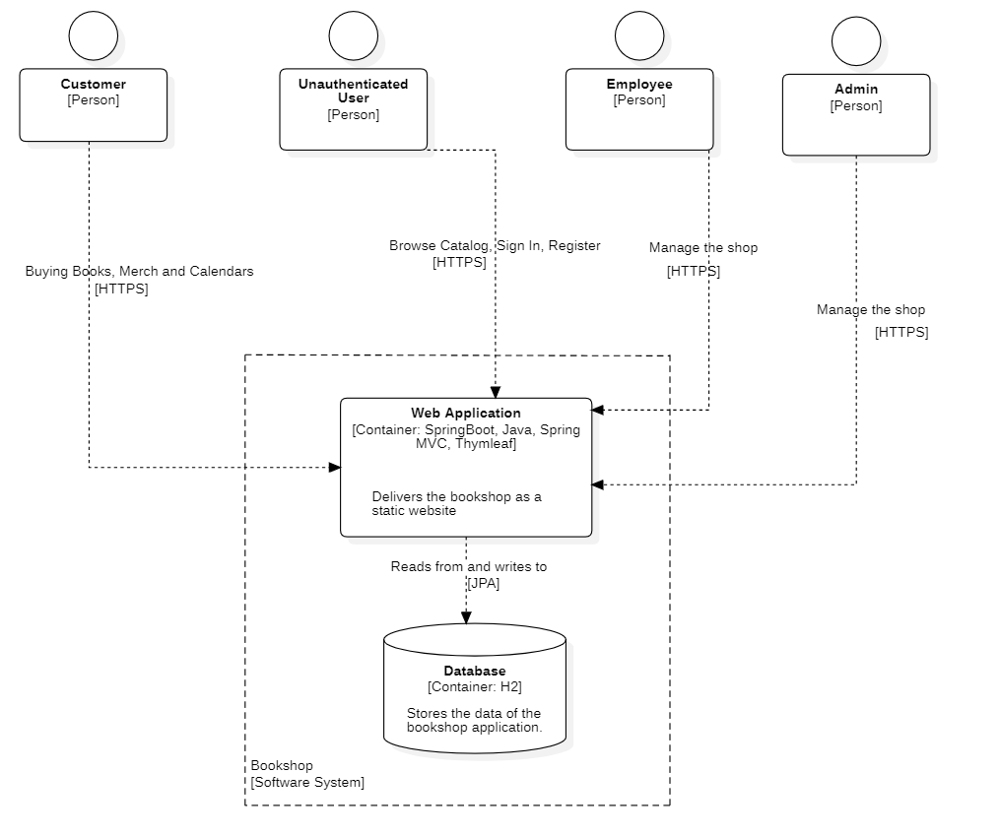

[[client_server_diagram]]
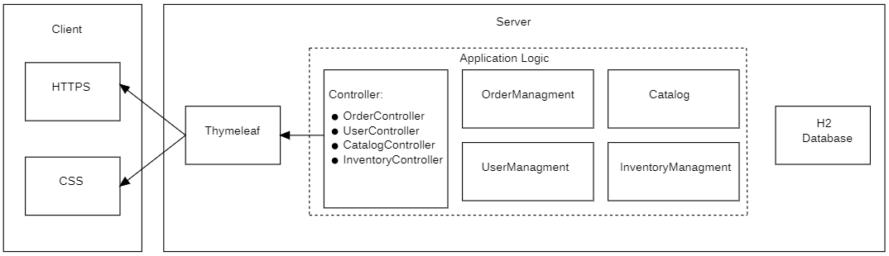

=== Architecture decisions

==== Design Patterns
* Spring MVC

==== Persistence
The application uses *Hibernate annotation based mapping* to map Java classes to database tables. As a database, *H2* is used.
The persistence is deactivated by default. To activate persistence storage, the following two lines in the file _application.properties_ have to be uncommented:
....
# spring.datasource.url=jdbc:h2:./db/videoshop
# spring.jpa.hibernate.ddl-auto=update
....

==== User Interface

[[user-interface]]
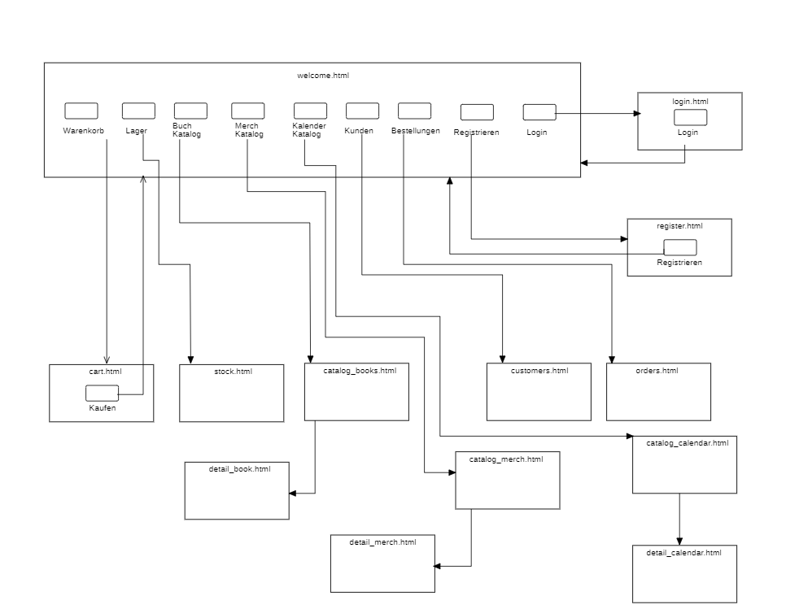

=== Use of external frameworks

[options="header"]
|===
|External library|Category
|Spring Boot|General purpose
|Spring Data JPA|Persistence
|Spring Security|Security
|Salespoint|Business Logic
|Semantic UI|UI
|jQuery|UI
|Bootstrap|UI and Appearance

|===

== Building block view

=== Package diagram

[[package_diagram]]
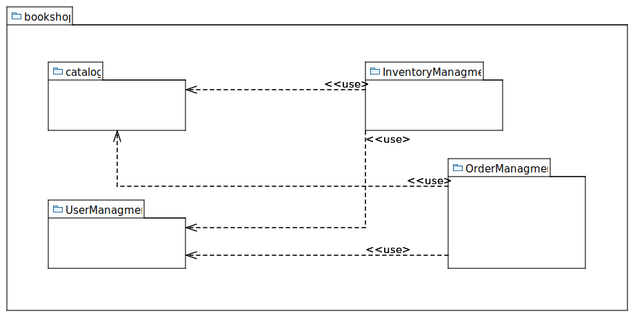

=== Bookshop

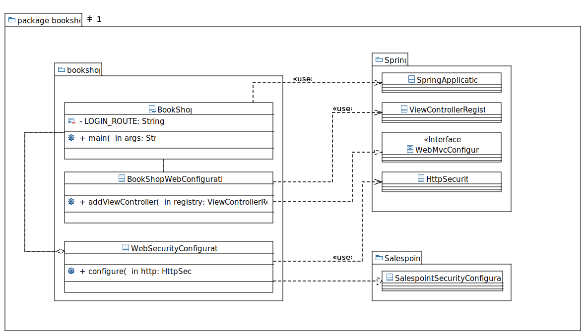

=== Catalog

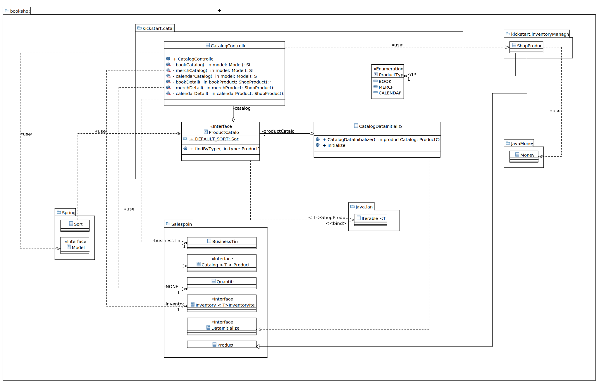

=== User

image::models/design/User/jUML_User.png[title = class design diagram - User]

=== Inventory

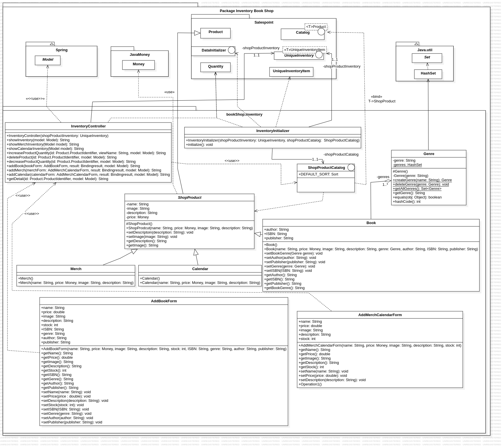

=== Order

image:models/design/Order/ClassDiagramOrder.png[title = class design diagram - order]

=== Traceability between Analysis- and Design Model

[options="header"]
|===
|Class/Enumeration (Analysis Model) |Class/Enumeration (Design Model)
|User   		       a|
* salespointframework.UserAccount
* bookshop.user.User
|Customer a|
* salespointframework.Role
* bookshop.user.Customer
|Admin      		   a|
* salespointframework.Role
* bookshop.user.Admin
|Product             	|bookshop.inventory.ShopProduct
|Book                   |bookshop.inventory.book
|Merch                  |bookshop.inventory.merch
|Calender               |bookshop.inventory.calender
|Image					|String
|Inventory              |salespointframework.UniqueInventory
|InventoryItem          |salespointframework.UniqueInventoryItem
|Order                  |salespointframework.Order
|Status                 |salespointframework.OrderStatus
|Cart                   |salespointframework.Cart
|Item                   |salespointframework.CartItem
|Catalog                |salespointframework.catalog
|Bookshop               |bookshop.Bookshop
|===

== Runtime view

=== Catalog
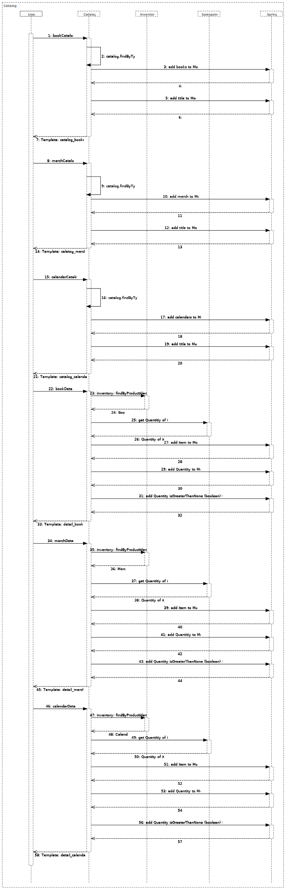

=== User
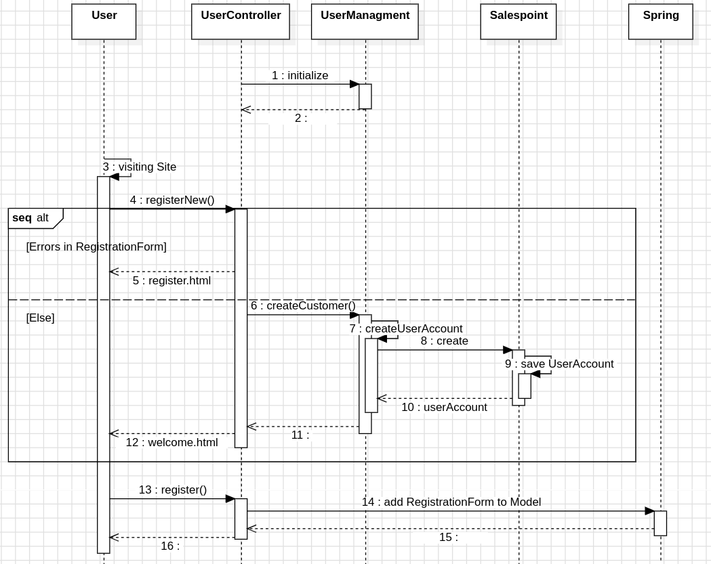

=== Inventory
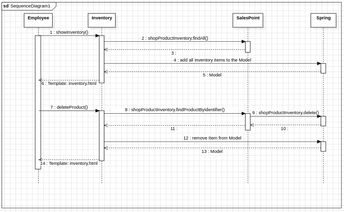

=== Order
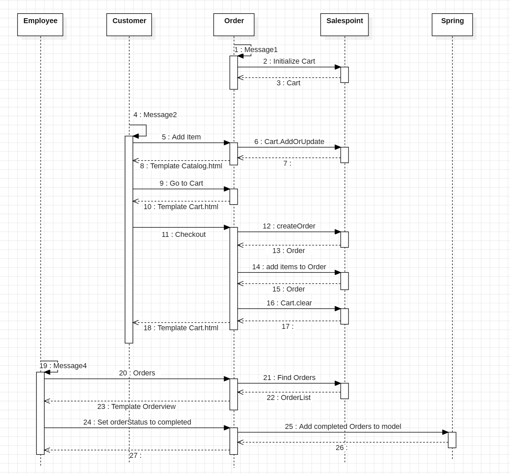

